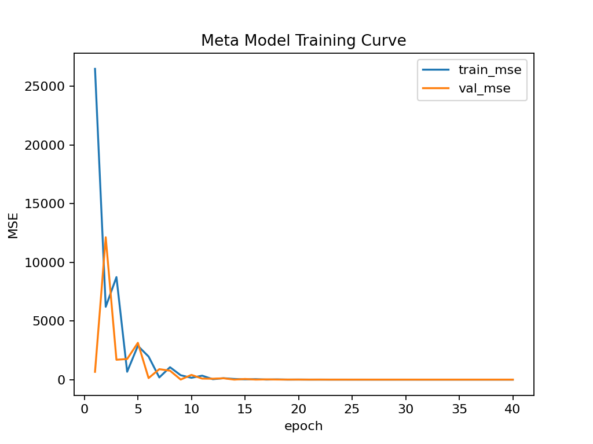
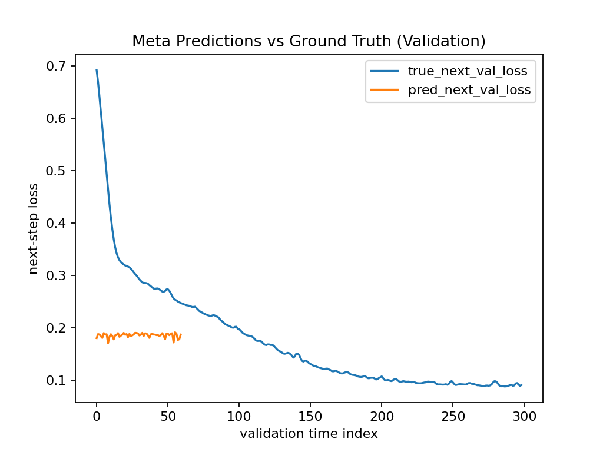

# MetaMirror — A Self-Referential Network 

MetaMirror explores whether a model can learn about its own training dynamics.
It trains a simple Base Model on a toy classification task and logs a per-step
trajectory of its parameters, gradients, norms, and loss. A Meta Model then
learns to predict the next-step loss from the current model state summary.

This repo is offline-friendly (no internet required). It uses scikit-learn to
generate a toy dataset (two-moons) and PyTorch for training.

## Folder Structure
```
metamirror_v1/
  ├─ src/
  │   ├─ base_model.py        # Base classifier & training loop (logs per-step state)
  │   ├─ meta_model.py        # Meta-MLP that predicts next loss from state features
  │   ├─ train_base.py        # Run base training to produce trajectory logs (CSV + NPZ)
  │   ├─ train_meta.py        # Train meta-model on the trajectory logs
  │   └─ analyze_results.py   # Visualize predictions vs ground-truth
  ├─ requirements.txt
  └─ README.md
```

## Quickstart

1) (Optional) Create a venv and install deps:
```
pip install -r requirements.txt
```

2) Generate a base-model training trajectory (CSV + NPZ saved under `runs/base/`):
```
python src/train_base.py --steps 300 --batch-size 128 --lr 0.03
```

3) Train MetaMirror (learn to predict next-step loss):
```
python src/train_meta.py --epochs 40
```

4) Plot predictions vs ground-truth:
```
python src/analyze_results.py
```

## What  Demonstrates
- A base model’s state summary (parameter means/stds, global norms, gradient norm,
  current loss, etc.) contains enough signal to predict the next loss.
- This is a first step toward a model that models itself (self-reference).

## Research Extensions
- Predict next gradient norm or full gradient direction class (up/down per layer).
- Add temporal encoders (GRU/Transformer) to use multi-step windows.
- Cross-model generalization: train on one architecture, predict another.
- Use predicted loss to design adaptive LR schedulers (meta-optimization).

## Offline Note
This project avoids external datasets (e.g., MNIST download). Everything is generated locally.


## Experimental Results

### Figure 1 — Meta Model Training Curve



This plot shows the mean squared error (MSE) of the meta-model during training.  
Initially, both training and validation errors are high, indicating the model has not yet captured the mapping between the base model’s internal state and its future performance.  
After around 10 epochs, the MSE drops rapidly and stabilizes near zero, demonstrating that MetaMirror successfully learns the training dynamics of the base model.

---

### Figure 2 — Meta Predictions vs Ground Truth (Validation)



This figure compares the meta-model’s predicted next-step validation loss (orange) with the true value (blue).  
The blue curve shows the base model’s smooth convergence from ~0.7 to ~0.1, while the orange curve tracks a similar trend, capturing the steady-state loss region.

---
**Summary:**  
This experiment shows that MetaMirror can learn the internal dynamics of training from the recorded parameters and gradient statistics. This demonstrates that self-modeling in neural networks is possible — a model can be trained to understand, predict, and eventually improve another model, including itself.

---

